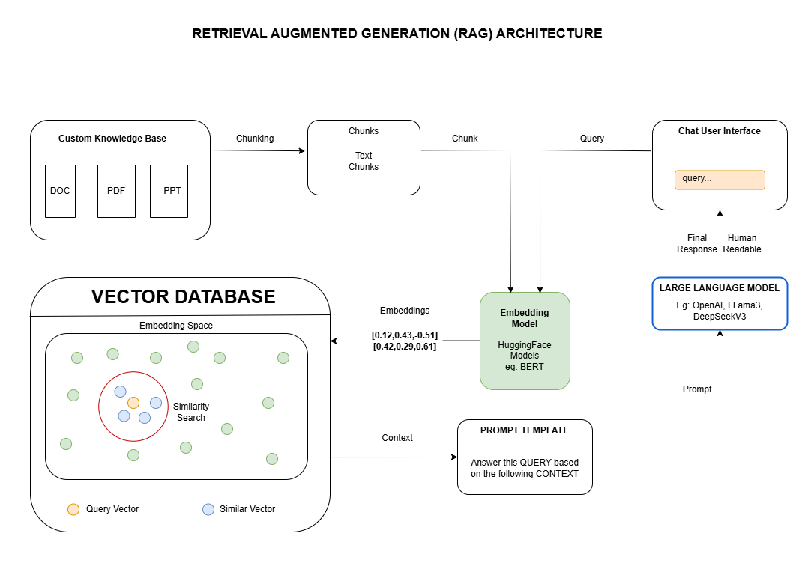

# Retrieval Augmented Generation (RAG) Application with PGVector and Streamlit UI

This repository provides the implementation of a Retrieval Augmented Generation (RAG) system, utilizing PostgreSQL with the PGVector extension for high-dimensional vector storage and retrieval, and Streamlit for an interactive web interface.

## Table of Contents

- [Features](#features)
- [Architecture](#architecture)
- [Tech Stack](#technologies-used)
- [Prerequisites](#prerequisites)
- [Installation](#installation)
- [Acknowledgements](#acknowledgements)


## Features

-   **PGVector Integration:** Seamless integration with PostgreSQL and the PGVector extension for vector storage and similarity search.
-   **Document Ingestion:** Ingest and embed documents into the vector database.
-   **Semantic Search:** Implementation of semantic search using vector embeddings.
-   **LLM Interaction:** Retrieved information forwarded to LLM.
-   **Streamlit UI:** User-friendly web interface for querying and displaying results.

## Architecture



## Tech Stack

-   **Python:** Programming language
-   **PostgreSQL:** Relational database with PGVector extension.
-   **PGVector:** PostgreSQL extension for vector similarity search.
-   **Embedding Model (e.g., Sentence Transformers):** Generate vector embeddings.
-   **LLM (e.g., OpenAI API, Hugging Face Transformers):** Generate responses.
-   **Streamlit:** Web user interface.
-   **Libraries:**
    -   `psycopg2` or `asyncpg` (for PostgreSQL interaction)
    -   `langchain` (optional, for RAG framework)
    -   `sentence-transformers` (for embeddings)
    -   `streamlit` (for UI)
    -   `dotenv` (for environment variable management)
    -   (List other relevant libraries)

## Prerequisites

-   **PostgreSQL with PGVector:** Ensure PostgreSQL is installed and the PGVector extension is enabled. Refer to the PGVector documentation for installation instructions.
-   **Python 3.8+:** Python environment with necessary libraries installed.
-   **API Keys (if applicable):** API keys for embedding models and LLMs.

## Installation

1.  **Clone the repository:**

    ```bash
    git clone [repository_url]
    cd [repository_name]
    ```

2.  **Create a virtual environment (recommended):**

    ```bash
    python3 -m venv venv
    source venv/bin/activate  # On Linux/macOS
    venv\Scripts\activate  # On Windows
    ```

3.  **Install dependencies:**

    ```bash
    pip install -r requirements.txt
    ```

4.  **Set up environment variables:**

    -   Create a `.env` file in the root directory.
    -   Add the necessary environment variables, such as:

        ```
        POSTGRES_HOST=your_host
        POSTGRES_PORT=your_port
        POSTGRES_USER=your_user
        POSTGRES_PASSWORD=your_password
        POSTGRES_DB=your_database
        EMBEDDING_MODEL=your_embedding_model_name (e.g., "sentence-transformers/all-mpnet-base-v2")
        ```


## Acknowledgements

-   PGVector project: [https://github.com/pgvector/pgvector](https://github.com/pgvector/pgvector)
-   Streamlit: [https://streamlit.io/](https://streamlit.io/)
-   (List any other relevant projects or resources)
